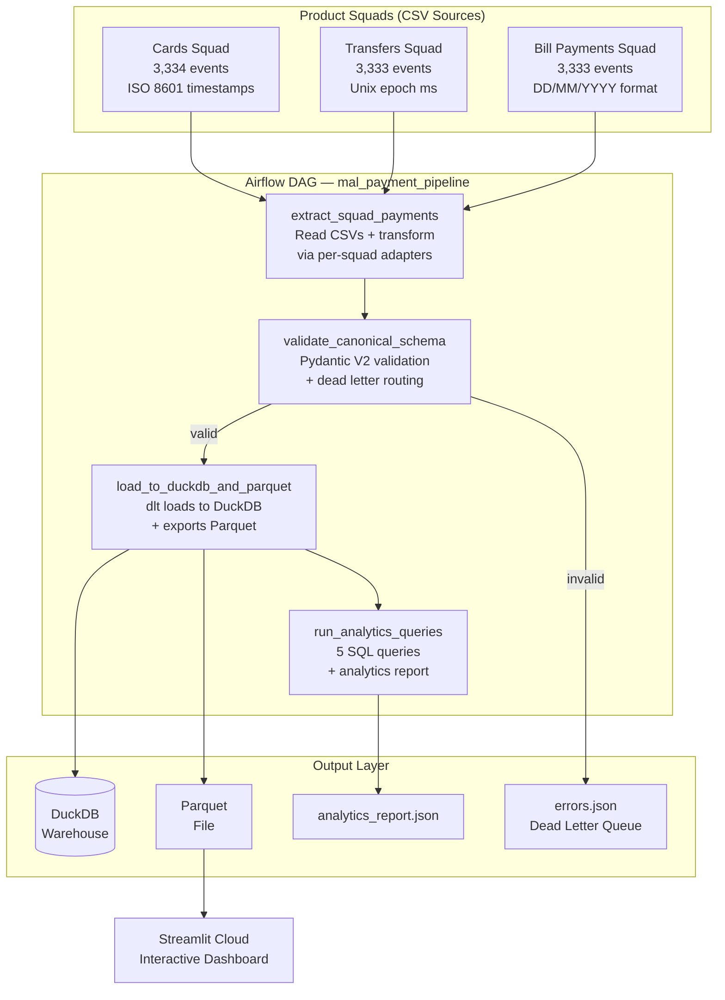
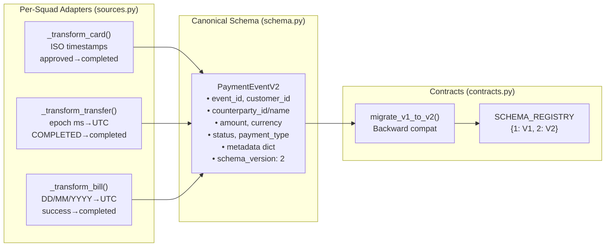
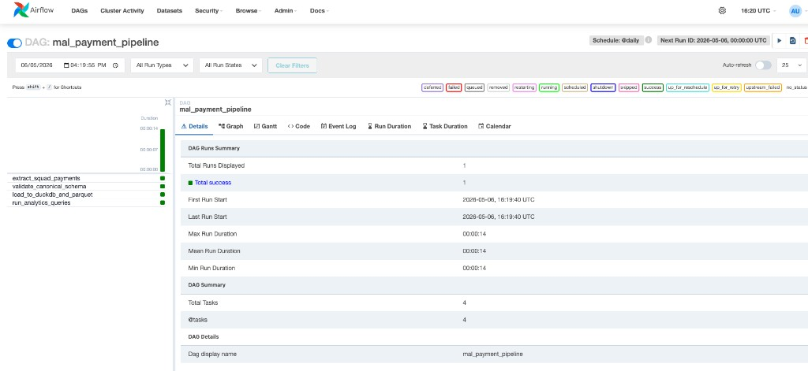
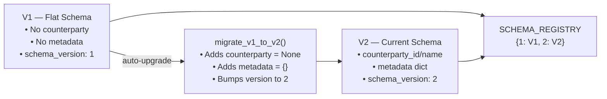

# Mal Unified Payment Data Platform

A production-grade data pipeline that unifies **10,000 payment events** from three product squads (Cards, Transfers, Bill Payments) into a single canonical model.

> **Live Demo:** [mal-cross-appuct-data-platform-bskrg8kmswshi6emybmfuh.streamlit.app](https://mal-cross-appuct-data-platform-bskrg8kmswshi6emybmfuh.streamlit.app/)

---

## Tech Stack

| Technology | Role | Why |
|------------|------|-----|
| [**Python 3.10+**](https://python.org) | Core language | Industry standard for data engineering |
| [**dlt (data load tool)**](https://dlthub.com/docs) | Ingestion & loading | Schema inference, evolution tracking, and DuckDB/BigQuery loading with minimal code |
| [**Apache Airflow**](https://airflow.apache.org/docs/) | Orchestration | Industry-standard DAG-based scheduler; TaskFlow API keeps pipelines Pythonic |
| [**Pydantic v2**](https://docs.pydantic.dev/latest/) | Schema validation | Type-safe data contracts with field validators and JSON Schema export |
| [**DuckDB**](https://duckdb.org/docs/) | Analytical warehouse | Zero-infrastructure OLAP — same SQL patterns work on Snowflake/BigQuery |
| [**Apache Parquet**](https://parquet.apache.org/) | Columnar storage | Portable, compressed, and queryable by any analytics tool |
| [**Streamlit**](https://docs.streamlit.io/) | Interactive dashboard | Live-filterable UI deployed on Streamlit Cloud for stakeholder demos |
| [**Docker**](https://docs.docker.com/) | Containerization | One-command reproducible environment for reviewers |

---

## Architecture



### Data Flow Detail



---

## Project Structure

```
mal-cross-product-data-platform/
├── app.py                          # Streamlit dashboard (deployed on Streamlit Cloud)
├── Dockerfile                      # Airflow container image
├── docker-compose.yml              # Multi-service orchestration
├── entrypoint.sh                   # Container entrypoint script
├── requirements.txt                # Python dependencies
├── requirements-docker.txt         # Docker-specific dependencies
├── data/
│   ├── raw/
│   │   ├── cards_events.csv          # Cards Squad (3,334 events)
│   │   ├── transfers_events.csv      # Transfers Squad (3,333 events)
│   │   └── bill_payments_events.csv  # Bill Payments Squad (3,333 events)
│   └── output/
│       └── payment_events.parquet    # Unified output (10,000 events)
├── dags/
│   └── payment_pipeline_dag.py       # Airflow DAG (TaskFlow API, 4 tasks)
├── src/
│   ├── __init__.py
│   ├── schema.py                     # Pydantic v2 models (V1 + V2)
│   ├── sources.py                    # dlt sources + per-squad transformers
│   ├── pipeline.py                   # Standalone runner (no Airflow needed)
│   └── contracts.py                  # Schema versioning & migration
├── sql/
│   └── queries.sql                   # 5 downstream analytical queries
├── tests/
│   └── test_pipeline.py              # 11 unit tests
└── docs/
    └── architecture-migration-strategy.md  # Part 2 document
```

---

## Quick Start

### Option 1: Docker (Recommended)

```bash
# 1. Clone the repo
git clone https://github.com/mhassan-k/mal-cross-product-data-platform.git
cd mal-cross-product-data-platform

# 2. Start Airflow (webserver + scheduler)
docker compose up --build -d

# 3. Open Airflow UI → trigger the DAG
open http://localhost:8080        # Login: admin / admin

# 4. Trigger the pipeline from CLI (alternative)
docker compose exec airflow-webserver airflow dags trigger mal_payment_pipeline

# 5. Run tests inside the container
docker compose exec airflow-webserver python -m pytest tests/ -v

# 6. Stop everything
docker compose down -v
```

**DAG Run — All 4 tasks completed successfully (10,000 events):**



### Option 2: Local Python

```bash
# 1. Clone & install
git clone https://github.com/mhassan-k/mal-cross-product-data-platform.git
cd mal-cross-product-data-platform
pip install -r requirements.txt

# 2. Run the pipeline (standalone, no Airflow needed)
python -m src.pipeline

# 3. View the Streamlit dashboard
streamlit run app.py
# Opens at http://localhost:8501

# 4. Run SQL queries directly
duckdb mal_payments.duckdb < sql/queries.sql

# 5. Run tests
pytest tests/ -v
```

### Option 3: Streamlit Cloud (View Only)

No setup needed — just open the live dashboard:

**[mal-cross-appuct-data-platform-bskrg8kmswshi6emybmfuh.streamlit.app](https://mal-cross-appuct-data-platform-bskrg8kmswshi6emybmfuh.streamlit.app/)**

Features:
- Filter by source system, payment type, status, currency, date range, and amount
- KPI metrics: total events, completed, failed, pending, total volume
- Payment volume by type and daily transaction trends
- Failure rate analysis by source system
- Cross-product customer table (active in 2+ products)
- Interactive SQL query runner
- CSV download of filtered data

---

## Canonical Schema (V2)

All three squad formats are normalized into a single `PaymentEventV2` model:

| Field | Type | Description |
|-------|------|-------------|
| `event_id` | UUID | Unique identifier (auto-generated) |
| `source_system` | enum | `cards` · `transfers` · `bill_payments` |
| `source_event_id` | string | Original ID from source system |
| `customer_id` | string | Normalized customer identifier |
| `counterparty_id` | string? | Receiver / merchant / biller code |
| `counterparty_name` | string? | Human-readable counterparty name |
| `amount` | decimal | Transaction amount (non-negative, validated) |
| `currency` | string | ISO 4217 3-letter code (validated) |
| `event_timestamp` | datetime | UTC-normalized timestamp |
| `status` | enum | `completed` · `failed` · `pending` |
| `payment_type` | enum | `card_transaction` · `transfer` · `bill_payment` |
| `payment_method` | string? | Card type / transfer type / bill category |
| `metadata` | dict | Source-specific fields (MCC code, biller code, reference note) |
| `schema_version` | int | Contract version (currently `2`) |

---

## Schema Versioning (Data Contracts)



- **V1**: Original flat schema — kept for backward compatibility
- **V2**: Adds `counterparty_id`, `counterparty_name`, and `metadata` dict
- `ensure_latest_version()` auto-upgrades any v1 records during pipeline execution
- [dlt](https://dlthub.com/docs/general-usage/schema) tracks schema evolution automatically in its metadata tables

---

## Sample SQL Queries

Five downstream analytical queries are included in `sql/queries.sql`:

| # | Query | Purpose |
|---|-------|---------|
| 1 | Daily payment volume by type | Time-series trend analysis |
| 2 | Failure rate by source system | Operational health monitoring |
| 3 | Top 10 counterparties | Business intelligence |
| 4 | Multi-currency breakdown | Cross-border payment analysis |
| 5 | Cross-product customers | Customer 360 / multi-product engagement |

---

## Key Design Decisions

| Decision | Rationale |
|----------|-----------|
| [**dlt**](https://dlthub.com/docs) for ingestion | Schema inference, evolution tracking, and destination-agnostic loading (swap DuckDB → BigQuery in one line) |
| [**Airflow TaskFlow API**](https://airflow.apache.org/docs/apache-airflow/stable/tutorial/taskflow.html) | `@task` decorators keep DAGs Pythonic; industry-standard orchestrator |
| **Dual run mode** | Airflow DAG for production; standalone `python -m src.pipeline` for dev/CI |
| **Docker Compose** | One `docker compose up` to start everything; zero local setup for reviewers |
| [**Pydantic v2**](https://docs.pydantic.dev/latest/) validation | Type safety, clear errors, JSON Schema export for data contracts |
| [**DuckDB**](https://duckdb.org) + Parquet | Zero-infrastructure analytics; same SQL patterns work on Snowflake/BigQuery |
| **Counterparty abstraction** | Unifies merchant / receiver / biller into one model — no type-specific schema explosion |
| **Dead-letter pattern** | Invalid records captured in `errors.json`; pipeline never blocks on bad data |
| **10K realistic events** | 200 customers, 5 currencies, realistic KSA merchants/billers/transfer patterns |

---

## Production Architecture

| Local (This Repo) | Production at Mal |
|-------------------|-------------------|
| CSV files | S3 event streams / Kafka topics |
| Airflow standalone | Managed Airflow (AWS MWAA, `me-south-1`) |
| DuckDB | Snowflake / BigQuery |
| `dlt.destinations.duckdb()` | `dlt.destinations.bigquery()` — one-line swap |
| Streamlit Cloud | Internal BI portal (Looker / Metabase) |
| `errors.json` | Dead-letter S3 bucket + PagerDuty alerting |
| 10K events | 100K+ transactions/day |
